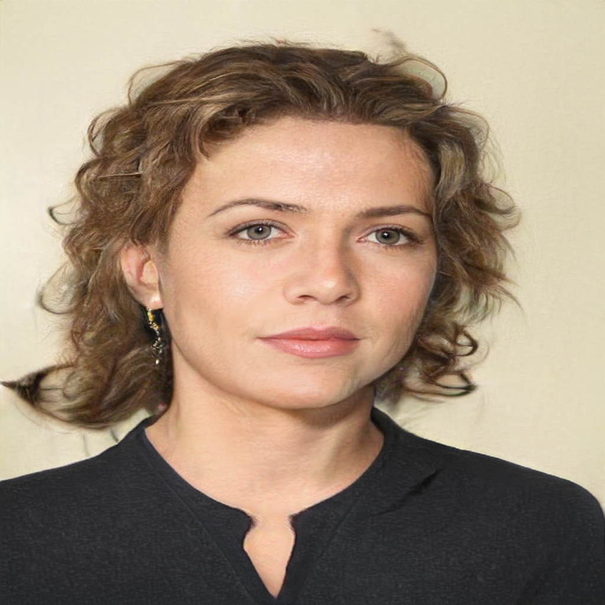

## StyleGAN2 and StyleGAN2-ada &mdash; Implementation on Human Portraits and Architectures

## Requirements
* Both Linux and Windows are supported. Linux is recommended for performance and compatibility reasons.
* 64-bit Python 3.6 installation. Anaconda3 with numpy 1.14.3 or newer is recommended.
* TensorFlow 1.14 is recommended. TensorFlow 1.15 is also supported on Linux, which we used for all our experiments, but  TensorFlow 2.x is <u>**not supported**</u>.
* On Windows you need to use TensorFlow 1.14, as the standard 1.15 installation does not include necessary C++ headers.
* One or more high-end NVIDIA GPUs, NVIDIA drivers, CUDA 10.0 toolkit and cuDNN 7.5. To reproduce the results reported in the paper, you need an NVIDIA GPU with at least 16 GB of DRAM.

## Installation
We implemented all the experiments on Linux (Ubuntu 18.04, later versions are also supported).

### Setting up CUDA Toolkit 10.0  
   
   `wget https://developer.download.nvidia.com/compute/cuda/repos/ubuntu1804/x86_64/cuda-ubuntu1804.pin`  
   `sudo mv cuda-ubuntu1804.pin /etc/apt/preferences.d/cuda-repository-pin-600`  
   `sudo apt-key adv --fetch-keys https://developer.download.nvidia.com/compute/cuda/repos/ubuntu1804/x86_64/7fa2af80.pub`  
   `sudo add-apt-repository "deb http://developer.download.nvidia.com/compute/cuda/repos/ubuntu1804/x86_64/ /"`  
   `sudo apt-get update`  
   `sudo apt-get install cuda-10-0`

The latest NVIDIA driver nvidia-driver-450 is a transient dependency of the package cuda-10-0 and will be automatically installed.   
You can set up CUDA 10.0 in parallel with newer CUDA versions, which are installed in `/usr/local/cuda-xx-x/`.

### Install TensorFlow 1.15
   Once *conda* is installed, you can set up a new Python3.6 environment named "TFenv" with  
   `conda create -n TFenv python==3.6.9`  
   and activates it   
   `conda activate TFenv`  
   `pip install scipy==1.3.3 requests==2.22.0 Pillow==6.2.1`  
   `pip install tensorflow-gpu==1.15.3`

## Data Preparation - get started
1. **Preparing datasets** - This is the phase where you can customize the dataset but also massive data collection is needed. The required number of images for a qualified dataset is very big. So this also a very time-consuming phase. ***Attention***: only `.jpg` and `.png` images are supported. Also pay attention to the color channels of your images. Only grayscale and RGB image dataset are supported now.
2. **Adjusting datasets** - If the original dataset is not adjusted to the required resolution - same power-of-two dimensions - (e.g., 1024 × 1024, 256 × 256, etc), they need to be cropped and reshaped. Our approach is to use landmark detection to get the position of the face, crop the face, and slightly modify the angle of the face to make it look straight ahead.
3. **Refining datasets** - Some photos would be blurred after processing. To improve the image quality, one Meitu API has been used to [deblur](https://ai.meitu.com/algorithm/faceTechnology/AIBeauty?t=1612749356096) the images. As there are massive photos need to be processed, we wrote a Python script to implement a *threadpool*, which helped us to process at least 40 thousand photos every 24 hours.
4. **Transforming datasets** - We used the Tensorflow version of [StyleGAN2](https://github.com/NVlabs/stylegan2) and [StyleGAN2-ada](./src). Therefore, before training, the prepared images needed to be transformed into `.tfrecords` files. We can simply run the `dataset_tool.py` file to achieve that. Here is an example command:  
   `python dataset_tool.py create_from_images ./datasets/birds ./birds-images`.

## Training & Monitoring
After the preparation stage, the training can be launched. We can run the `train.py` (in StyleGAN2-ada) file or the `run_training.py` file (in StyleGAN2) to start training. Here is an example command for *StyleGAN2-ada*:  
`python train.py --outdir=./training-runs --gpus=1 --data=./datasets/birds`.

PS: Users can customize the training configuration, such as `--gpus=4`, `--gamma=10`, etc. To see the full list, please refer to `python train.py --help` (for *StyleGAN2-ada*) or `python run_training.py --help` (for *StyleGAN2*). 

While training, we kept track the value of *FID* as its variation indicates whether the training is going well or not. It is also crucial to keep an eye on the newly-generated images on each round to guarantee that the training is running normally.

## Outcomes

### Portraits - Shoulders
After collecting and processing almost half million images, we successfully prepared a decent dataset to train a model for potrait images with shoulders. Here are some generated images of our early achievement.  

### Classical Architectures
After implementing a simple architecture classifier model, we used the classifier to categorize our images and we chose to train a classical architecture model in the first place as it is the most complicated one to train. If we could tackle the classical model, for the rest architecture models, it will not be a big problem. Here are some early results of our training.  

## Training Experience
According to our experience, to train a model from scratch, at least 5000 photos are needed for StyleGAN2 and 3000 photos for StyleGAN2-ada. For fine-tuning, at least 3000 images are needed for StyleGAN2 and 1500 for StyleGAN2-ada.

## Contact
If you have any question about the project, feel free to contact us at xuchen.zheng@pixocial.com.
